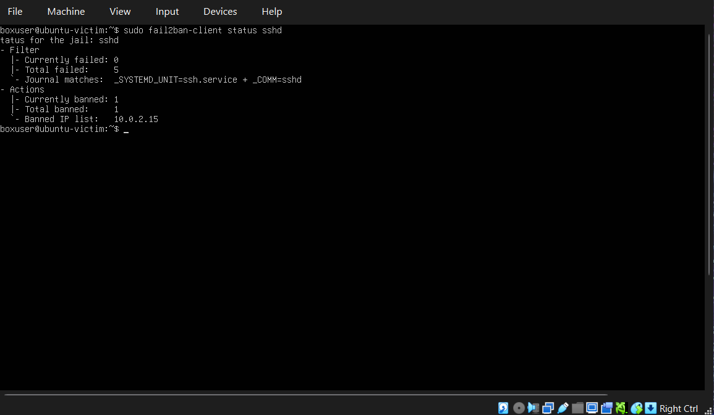
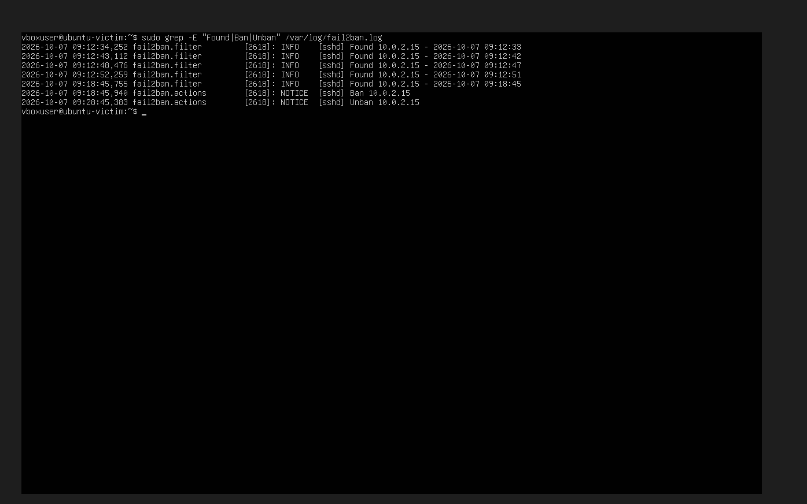

Incident Report: SSH Failed Logins
Date: 2026-10-07
Victim: ubuntu-victim (10.0.2.4)
Attacker: Kali (10.0.2.15)
What happened: Multiple failed SSH logins using invalid and valid usernames, plus an nmap scan showing only port 22 open.
First failure: 07:26:26 UTC
Usernames tried: fakeuser (invalid), vboxuser (valid)
Total failed attempts: 6
  - 3 against invalid user fakeuser
  - 3 against valid user vboxuser
Recommended actions: block attacker IP, disable password login and use SSH keys, install fail2ban, monitor auth logs.
## Response: fail2ban
Configuration: sshd jail, maxretry=5, findtime=10m, bantime=10m.
Timeline: 5 failed logins from 10.0.2.15 between 09:12:33 and
09:18:45 UTC. Banned at 09:18:45 UTC, automatically unbanned at
09:28:45 UTC.
Result: attacker blocked without manual action; Kali received
"Connection refused" on port 22.

## Evidence

